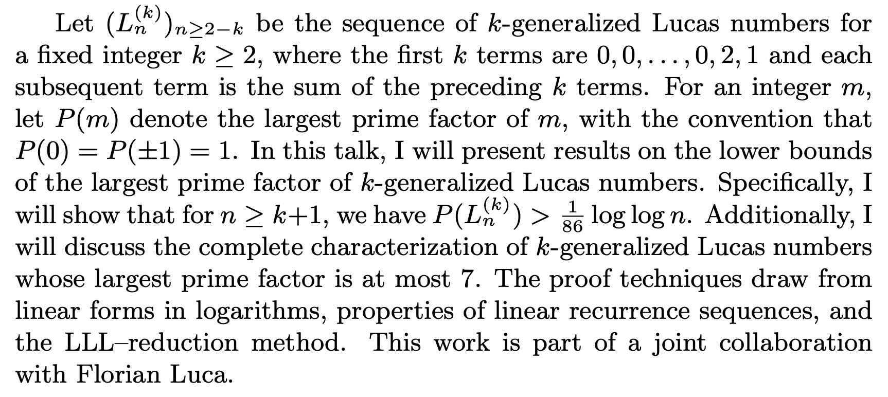
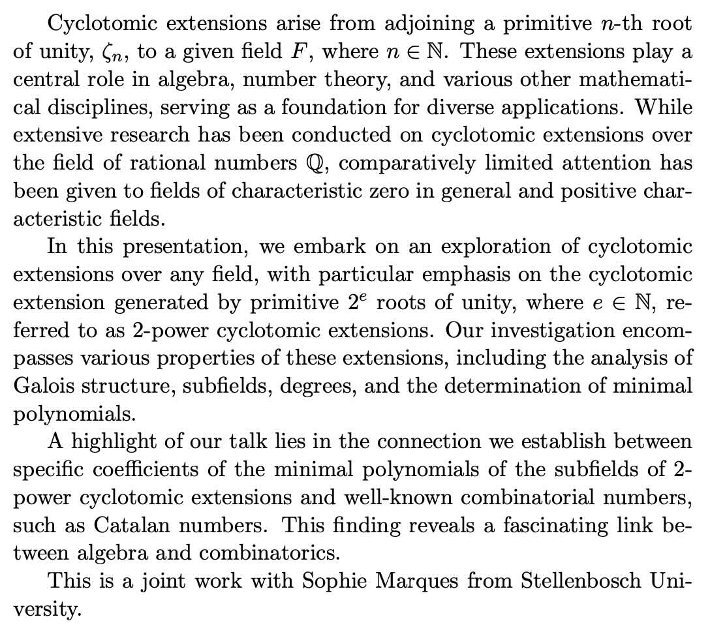

An informal seminar to connect researchers in Africa, China and elsewhere.

Focussing on pure mathematics and related topics.

Welcome to register for updates: from [China](https://wj.qq.com/s2/17722269/1b09/) / [elsewhere](https://forms.gle/FZ2CMXZU3Avm2PsK7).

Organizer: Will Donovan

We plan to use the following format, to promote conversation in online setting.

* 20 minute talk (introduction)
* 10 minute discussion
* 20 minute talk (continued)

## Participants

* Walle Tilahun, Mizan Tepi University, Ethiopia
* Lakachew Ayal Chekol, Woldia University, Ethiopia
* Herbert	Batte,	Makerere University / Wits University, Johannesburg
* Tagay Takele Fikadu, Ethiopia 
* Bukayaw	Kindu, Debre Markos University
* Annet	Kyomuhangi, Busitema University, Tororo, Uganda
* Kefale Liche Mandida, Addis Ababa University, Ethiopia 
* Brian Makonzi, Makerere University
* Elizabeth Mrema, Dar es Salaam, Tanzania
* Caroline Namanya, Uganda	
* Ismail Opio, Lira University, Uganda
* Belela Samuel, Ethiopia
* Chala	Tena Moti, Dire Dawa, Ethiopia
* Tilahun Walle, Ethiopia
* Girma	Workneh, Ethiopia
* Beza Zeleke, Ethiopia

# Talks

* West Africa Time: 9am
* East Africa Time: 11am
* China time: 4pm	

## Herbert Batte (Makerere University / Wits University, Johannesburg)

Nov 28 2024

On the Largest Prime Factor of the k-generalized Lucas Numbers

## Elizabeth Mrema

Dec 5 2024

Exploration of Cyclotomic Extensions

## TBD

Dec 12 2024

## TBD

Dec 19 2024
