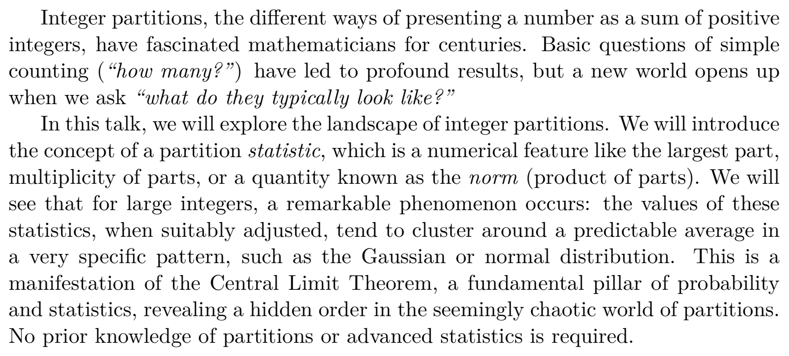

An informal seminar to connect researchers in Africa, China and elsewhere.

Focussing on pure mathematics and related topics.

Welcome to register for updates: from [China](https://wj.qq.com/s2/17722269/1b09/) / [elsewhere](https://forms.gle/FZ2CMXZU3Avm2PsK7).

Organizer: Will Donovan

We plan to use the following format, to promote conversation in online setting.

* 20 minute talk (introduction)
* 10 minute discussion
* 20 minute talk (continued)

## Participants

* Walle Tilahun, Mizan Tepi University, Ethiopia
* Lakachew Ayal Chekol, Woldia University, Ethiopia
* Herbert	Batte,	Makerere University / Wits University, Johannesburg
* Tagay Takele Fikadu, Ethiopia
* Xin GENG 耿鑫, China
* Dennis Kinoti	Gikunda, Stellenbosch University, South Africa
* David HUI, China
* Bukayaw	Kindu, Debre Markos University
* Annet	Kyomuhangi, Busitema University, Tororo, Uganda
* Kefale Liche Mandida, Addis Ababa University, Ethiopia 
* Brian Makonzi, Makerere University
* Elizabeth Mrema, Dar es Salaam, Tanzania
* Caroline Namanya, Uganda
* Farha	Nazreen, University of Nairobi, Kenya	
* Ismail Opio, Lira University, Uganda
* Belela Samuel, Ethiopia
* David	Ssevviiri, Uganda
* Haoyu SUN 孙昊宇, China
* Youran SUN 孙悠然, China
* Chala	Tena Moti, Dire Dawa, Ethiopia
* Tilahun Walle, Ethiopia
* Girma	Workneh, Ethiopia
* Beza Zeleke, Ethiopia

# Talks

* West Africa Time: 9am
* East Africa Time: 11am
* China time: 4pm	

## Dennis Kinoti Gikunda (Stellenbosch University, South Africa)

Nov 18 2025

From Counting to Distribution: A Statistical View of Integer Partitions

## Herbert Batte (Makerere University / Wits University, Johannesburg)

Nov 28 2024

On the Largest Prime Factor of the k-generalized Lucas Numbers

## Elizabeth Mrema

Dec 5 2024

Exploration of Cyclotomic Extensions

## SUN Youran 孙悠然

Mar 5 2025

Phase Transitions in Large Language Models and the O(N) Model

Large language models (LLMs) exhibit unprecedentedly rich scaling behaviors. In physics, scaling behavior is closely related to phase transitions, critical phenomena, and field theory. To investigate the phase transition phenomena in LLMs, we reformulated the Transformer architecture as an O(N) model. Our study reveals two distinct phase transitions corresponding to the temperature used in text generation and the model's parameter size, respectively. The first phase transition enables us to estimate the internal dimension of the model, while the second phase transition is of *higher-depth* and signals the emergence of new capabilities. As an application, the energy of the O(N) model can be used to evaluate whether an LLM's parameters are sufficient to learn the training data.

## YANG Fang 杨芳

Mar 12 2025

Quantum cluster algebras associated to weighted projective lines

Quantum cluster algebras, introduced by Berenstein and Zelevinsky (2005) as a quantum analog of cluster algebras, provide a framework for better understanding canonical bases in quantum groups. While additive categorification via cluster categories of quivers with potentials is well established for cluster algebras, it remains open for quantum cluster algebras beyond acyclic quivers.

Weighted projective lines and the category of coherent sheaves on them, introduced by Geigle and Lenzing (1987), share many key properties with the categories of representations of acyclic quivers, such as being hereditary and admitting tilting objects. Building on this, we use the category of coherent sheaves on a weighted projective line to provide an additive categorification for the corresponding quantum cluster algebra.

## ZHAO Qixian 赵启弦

Mar 26 2025

A number game, nilpotent orbits, and affine cells

Consider a circle of n+1 integers where one of them is negative and the others are equal to 1. Perform the following algorithm: at each step one chooses a negative number, adds it to adjacent numbers, negates the chosen number, then repeats this process. Does the algorithm terminates? If it does, can we describe the end result?

This problem appears in the following picture in representation theory. Let g be a simple Lie algebra and let g' be its Langlands dual. A classical result of many people (partially Barbasch-Vogan) is a bijection between the set of two-sided cells in the Weyl group W and the set of special nilpotent orbits in g (or g'). Lusztig proved an affine version of this in a very different way, where one considers cells in the affine Weyl group on one side and the set of all nilpotent orbits in g' on the other side. The goal of this talk is to demonstrate that a subset of Lusztig's correspondence can be constructed in the Barbasch-Vogan flavor, and part of the proof can be rephrased as the above combinatorial problem. If time permits, we will discuss its relation to affine Springer fibers and affine vertex algebras. This is based on joint work with Peng Shan and Wenbin Yan.
